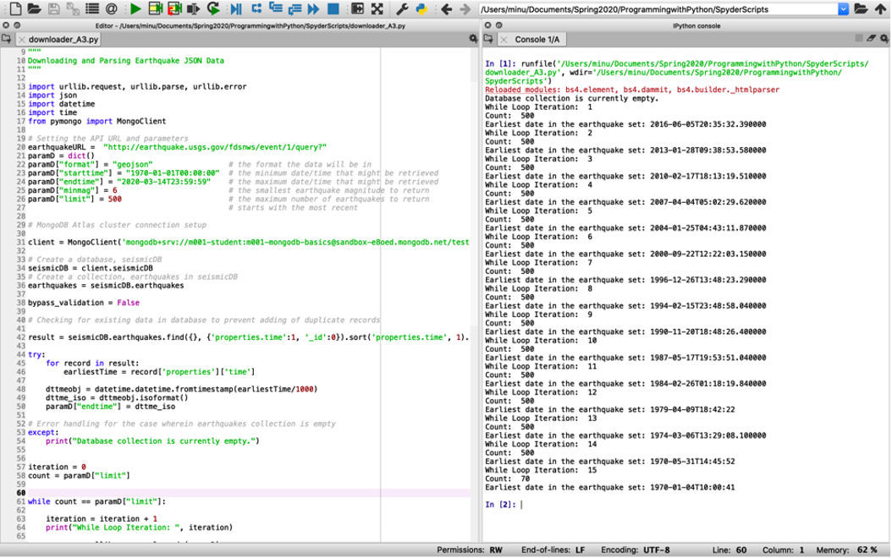
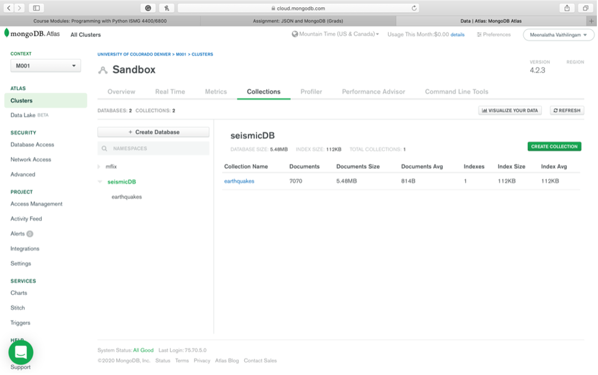
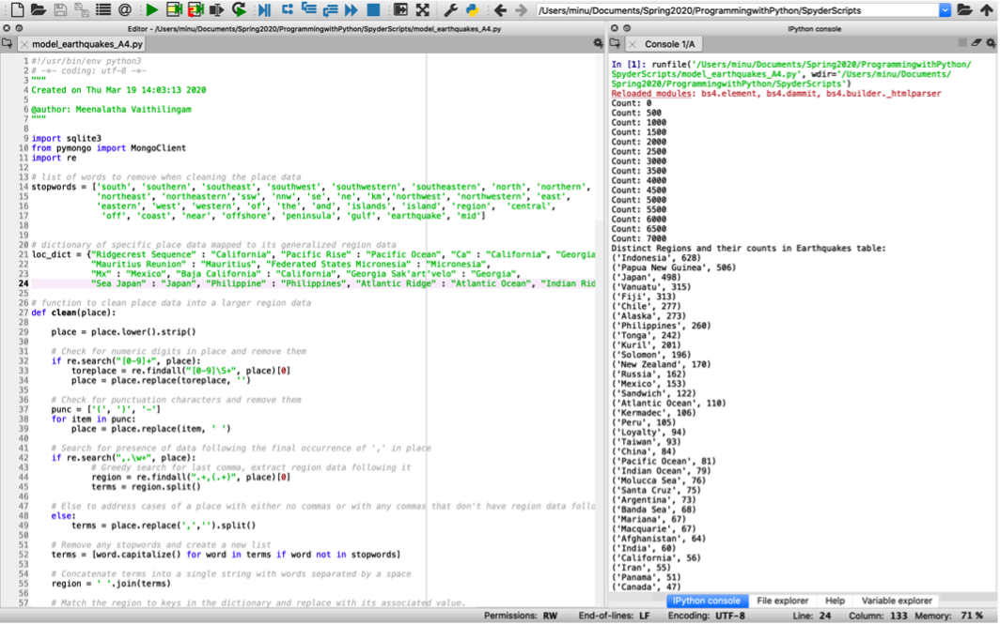
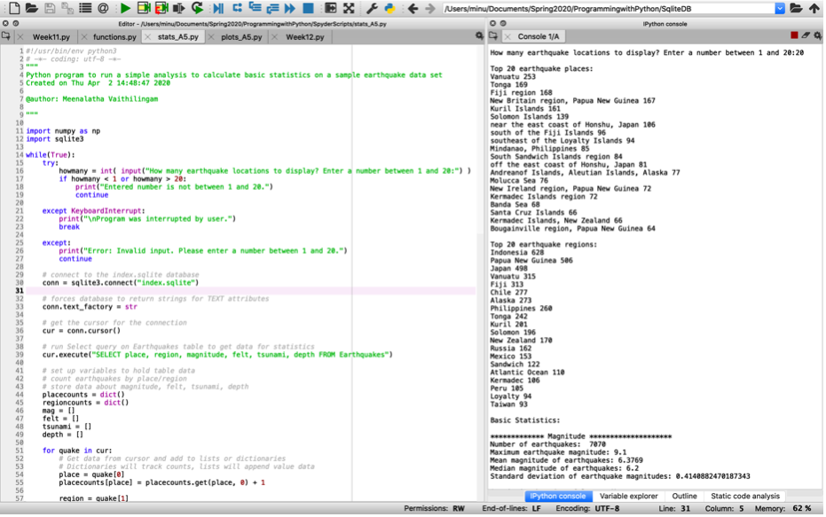
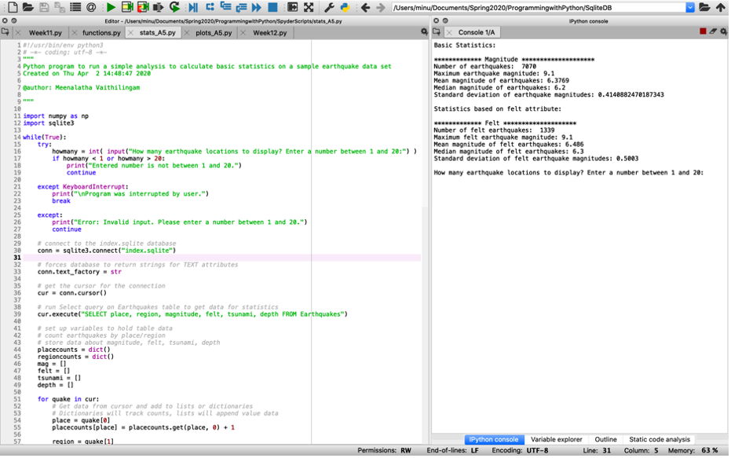
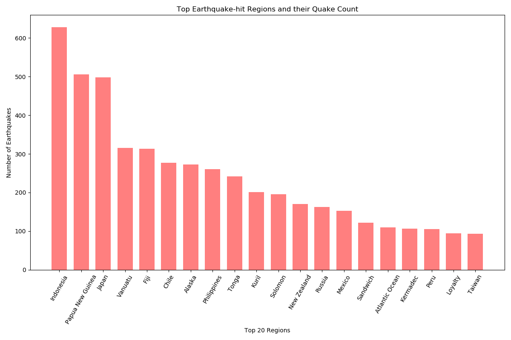
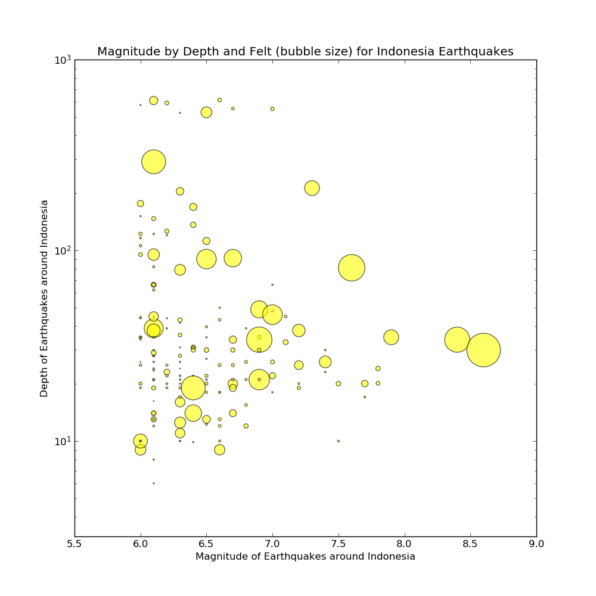
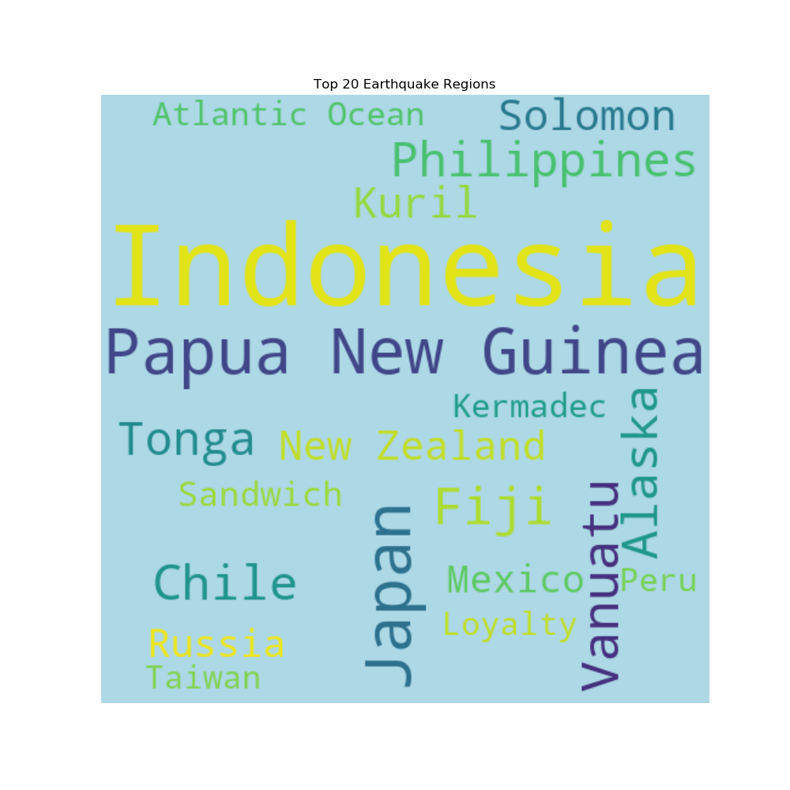
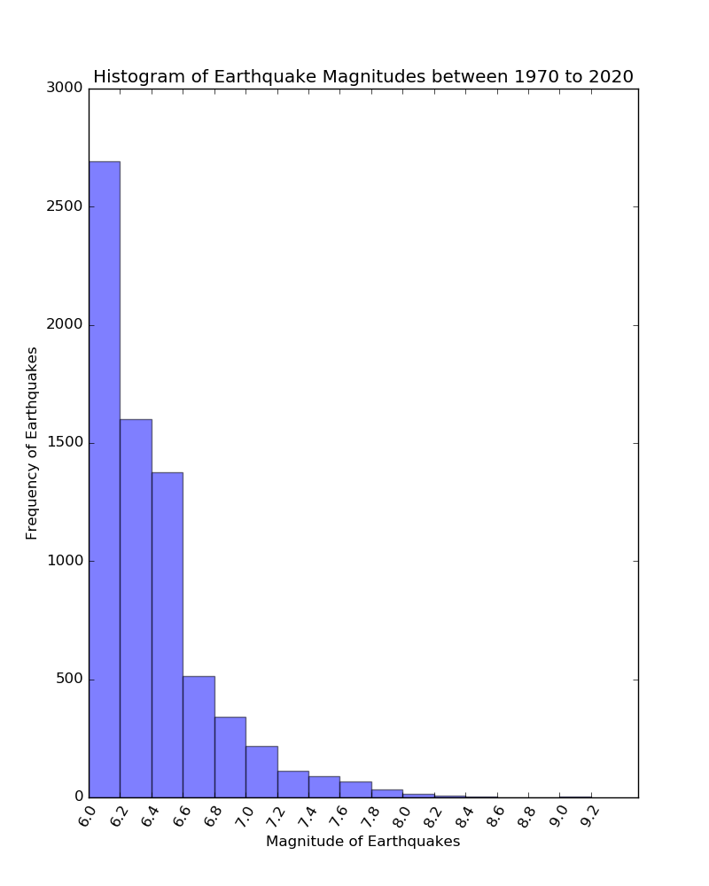
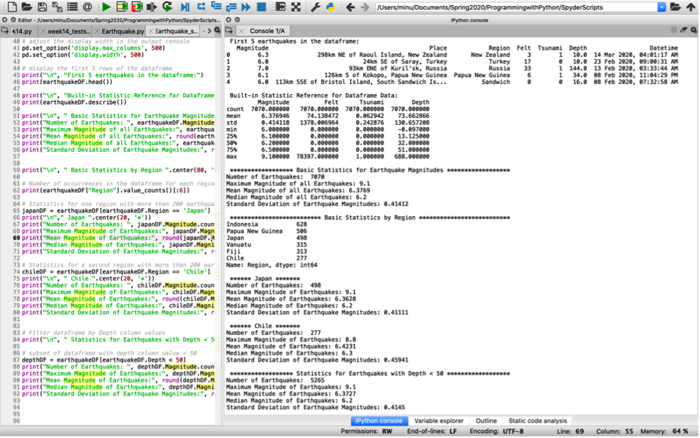

# Earthquake-Data-Analytics with Python

 
 

<h2>Step 1</h2>

Running the downloader.py program to download earthquake data from the USGS API:

7070 documents downloaded into the seismicDB.earthquakes collection on MongoDB:

 

<h2>Step 2</h2>

Data cleaning, preparation and modeling; running the model_earthquakes.py application to insert earthquake data into index.sqlite DB:

 

model_earthquakes.py reads the rough/raw data from MongoDB and produces a cleaned-up, well-modeled version of the data in the file index.sqlite.
The file index.sqlite will be much smaller (often 10X smaller) than the raw data because it only contains the data we plan to use in our data analytics tasks.
Each time model_earthquakes.py runs - it will completely wipe out and re-build index.sqlite database allowing us to adjust its parameters and edit the mapping tables in index.sqlite to tweak the data cleaning process.

It should store the following data from the MongoDB data:
  <ul>
    <li>Earthquake ID</li>
    <li>magnitude</li>
    <li>time</li>
    <li>long</li>
    <li>lat</li>
    <li>depth</li>
    <li>place</li>
    <li>title</li>
    <li>felt</li>
    <li>tsunami</li>
    </ul>
Add a new additional column/variable named "region". Region is similar to place but more general-this will allow us to compute statistics and create plots by region.
 

<i>place: 118km E of Kimbe, Papua New Guinea 
region: Papua New Guinea</i>

<i>place: 22km SSW of Bodfish, CA 
region: California</i>

<i>place: 253km W of Ferndale, California
region: California</i>

This requires the place be run through a cleaning process to group earthquake places into larger regions. This process should addresses several problems with the place variable.

The place names above are too specific to allow for us to determine how many earthquakes occur in a particular location.
A second problem with the place names is that the names are inconsistent. California is sometimes referred to as "California" or "CA", the "Fiji Islands" are also referred to as the "Figi region" or just "Fiji"

 

<b>Data cleaning methods to clean the "place" data into a larger "region":</b>

Create a method that will be passed a place and that will then modify that place using Stopwords, Removal of punctuation, String methods and Regular Expressions.
In most cases we will only want the part of the place name that follows the final comma in the string.
Once we have that piece of the place string we might want to replace CA with California, MX with Mexico, Fiji Islands with Figi etc. (key value pairs from a dictionary)
We would also need to remove directional words (e.g. ['Southeast', 'Southwest', 'southeast', 'southwest', 'southern', 'southern', 'South', 'south'  ...]).
Once we have made the changes we will want to strip any extra white space that may exist.

 

<h2>Step 3</h2>

Running the stats.py program to display top places, top regions and calculate basic statistics:

 

Running the plots.py program to visualize the statistics through graphs, charts, and plots:

 

<h2>Step 4 (Optional)</h2>

Running the Earthquake_stats.py program to display basic earthquake statistics established in Step 3 but this time using OOP and Pandas dataframe:

